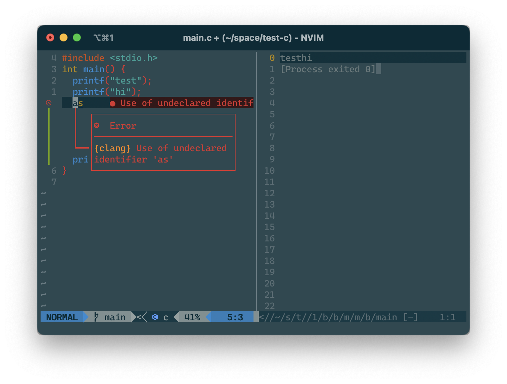

# **My Neovim setup**
This is my Neovim setup for coding more productive and speed.

### **Image Preview**
- Split windows in Nvim.


### **Go to**
- [Version Record](./version-record.json)
- [Fish Shell](https://github.com/chinhchin/Fish-Shell-setup.git)

### **Credits**
- Inspiration, list of modules and solution from [craftzdog/dotfiles-public](https://github.com/craftzdog/dotfiles-public.git)

### **Packages requirement**
- [Brew](https://github.com/chinhchin/Brew-setup.git)
- [Fish Shell](https://github.com/chinhchin/Fish-Shell-setup.git)

### **Contents**
#### 0. [Update Your Installer](./readme.md#0-update-your-installer)

#### 1. [Install Neovim](./readme.md#1-install-neovim)
1. [Install Neovim](./readme.md#11-install-neovim)
2. [Link to Vim](./readme.md#12-link-to-vim)

#### 2. [Install useful plugins in Neovim](/readme.md#2-install-useful-plugins-in-neovim)
1. [Install vim-plug](./readme.md#21-install-vim-plughttpsgithubcomjunegunnvim-pluggit---vim-plugin-manager)
2. [Add config file](./readme.md#22-add-config-file)
3. [Install plugins in vim-plug](./readme.md#23-install-plugins-in-vim-plug)
4. [Activate defx.nvim](./readme.md#24-activate-defxnvim)

#### 3. [Install language servers and completion](./readme.md#3-install-language-server-and-completion)
1. [Install language server in Nvim Lsp](./readme.md#31-install-language-servers-in-nvim-lsphttpsmicrosoftgithubiolanguage-server-protocol)
2. [Install language servers in Coc](./readme.md#32-install-language-servers-in-cochttpsgithubcomneoclidecocnvim)

### 4. [Useful features](./readme.md#4-useful-features)
1. [Basic command shortcuts](./readme.md#41-basic-command-shortcuts)
2. [Screen spliter shortcuts](./readme.md#42-screen-spliter-shortcuts)
3. [Tabedit shortcuts](./readme.md#43-tabedit-shortcuts)
4. [File edit in Nvim](./readme.md#44-file-edit-in-nvim)
5. [Telescope](./readme.md#45-telescope)
6. [Code suggested, completion and data](./readme.md#46-code-suggested-completion-and-data)
7. [Run code](./readme.md#47-run-code)

---

> **Important**
>
> You should use this in Fish shell in my config.
> See it in [packages requirement](./readme.md#packages-requirement)

## **0. Update your installer**
```
sudo apt update && sudo apt upgrade
brew update
```

> **Note**
>
> I use debian Linux so, I update apt.
> If you use other, update you should update your Linux before start.

## **1. Install Neovim**

### **1.1 Install Neovim**
Type this command into your terminal.
```
brew install neovim
```

### **Link vim command to nvim**
On *macOS* type,
```
sudo ln -s (which nvim) /opt/homebrew/bin/vim
```

On *Linux* type,
```
sudo ln -s (which) /home/linuxbrew/.linuxbrew/bin/vim
```

## **2. Config Neovim**
### **2.1 Add config file**
```
# Check if ~/.config directory is exist.
cd ~
if not test -d ~/.config ; mkdir .config ; end

# Check if ~/Donwloads folder exists.
if not test -d ~/Downloads ; mkdir ~/Downloads ; end

# Clone repository
git clone https://github.com/chinhchin/Neovim-setup.git ~/Downloads/Neovim-setup

# Copy folder
cp -r ~/Downloads/Neovim-setup/nvim/ ~/.config/nvim
```

### **2.2 Install and activate [packer.nvim](https://github.com/wbthomason/packer.nvim)**

Type this command in terminal
```
git clone --depth 1 https://github.com/wbthomason/packer.nvim ~/.local/share/nvim/site/pack/packer/start/packer.nvim
```

Type this command in nvim
```
:PackerInstall
```

